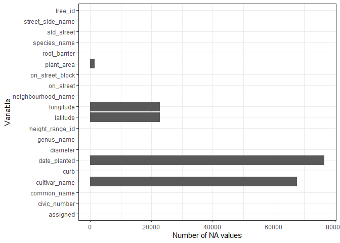
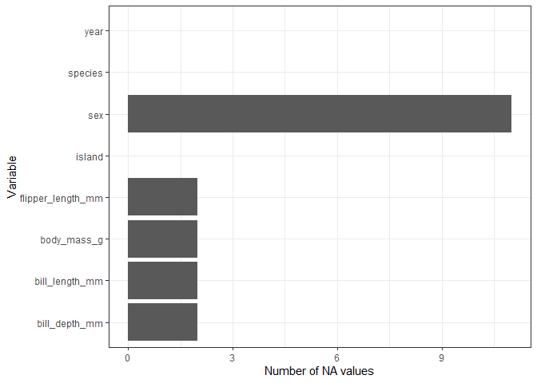
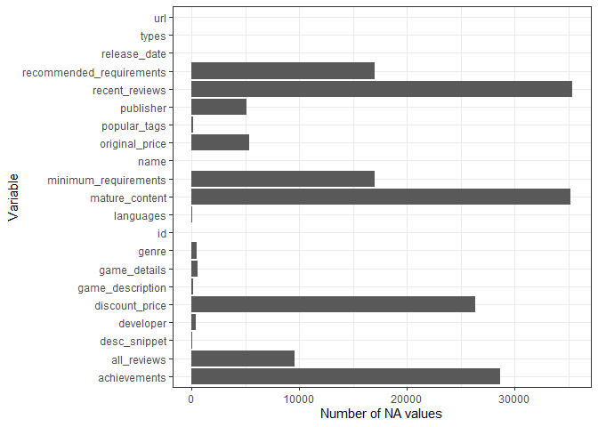

STAT545B_Assignment1
================
Jérôme Plumier
2023-11-01

For this assignment, first we need to load some packages.

``` r
library(tidyverse)
```

    ## ── Attaching core tidyverse packages ──────────────────────── tidyverse 2.0.0 ──
    ## ✔ dplyr     1.1.3     ✔ readr     2.1.4
    ## ✔ forcats   1.0.0     ✔ stringr   1.5.0
    ## ✔ ggplot2   3.4.3     ✔ tibble    3.2.1
    ## ✔ lubridate 1.9.2     ✔ tidyr     1.3.0
    ## ✔ purrr     1.0.2     
    ## ── Conflicts ────────────────────────────────────────── tidyverse_conflicts() ──
    ## ✖ dplyr::filter() masks stats::filter()
    ## ✖ dplyr::lag()    masks stats::lag()
    ## ℹ Use the conflicted package (<http://conflicted.r-lib.org/>) to force all conflicts to become errors

``` r
library (ggplot2)
library(datateachr) #contains dataset that shall be used to test the function
library(palmerpenguins) #contains dataset that shall be used to test the function
library(testthat) #package that allows evaluation and testing of our function
```

    ## 
    ## Attachement du package : 'testthat'
    ## 
    ## L'objet suivant est masqué depuis 'package:dplyr':
    ## 
    ##     matches
    ## 
    ## L'objet suivant est masqué depuis 'package:purrr':
    ## 
    ##     is_null
    ## 
    ## Les objets suivants sont masqués depuis 'package:readr':
    ## 
    ##     edition_get, local_edition
    ## 
    ## L'objet suivant est masqué depuis 'package:tidyr':
    ## 
    ##     matches

## Exercise 1: Make a Function (25 points)

I elected to create a function that creates a plot I have used for the
mini data analysis project in STAT545A. This function permits the
visualization of the number of NA values for each variable in a data
frame. I believe this function is valuable when encountering a new
dataset.

``` r
seeNA <- function(dataframe) {
  if(!(is.data.frame(dataframe))) {
    stop('The imput needs to be a data frame.')}
  if(sum(is.na(dataframe))==0) {
    stop('The dataframe has no NA values.')}
  if(sum(is.na(dataframe))==length(as.matrix(dataframe))){
    stop('The dataframe only has NA values.')}
  seeNA_dataframe <- dataframe%>% 
    summarise(across(everything(), ~ sum(is.na(.))))
  seeNA_dataframe <- as.data.frame(t(as.matrix(seeNA_dataframe))) 
  seeNA_dataframe$variable <- rownames(seeNA_dataframe)
  rownames(seeNA_dataframe) <- 1:nrow(seeNA_dataframe)
  colnames(seeNA_dataframe) <- c("NA_count", "Variable")
  ggplot(seeNA_dataframe, aes(y=Variable))+
  geom_bar(aes(weight=NA_count))+
  theme_bw() +
  xlab("Number of NA values")
}
```

## Exercise 2: Document your Function (20 points)

``` r
seeNA <- function(dataframe) {
  if(!(is.data.frame(dataframe))) {
    stop('The imput needs to be a data frame.')}
  if(sum(is.na(dataframe))==0) {
    stop('The dataframe has no NA values.')}
  if(sum(is.na(dataframe))==length(as.matrix(dataframe))){
    stop('The dataframe only has NA values.')}
  seeNA_dataframe <- dataframe%>% 
    summarise(across(everything(), ~ sum(is.na(.))))
  seeNA_dataframe <- as.data.frame(t(as.matrix(seeNA_dataframe))) 
  seeNA_dataframe$variable <- rownames(seeNA_dataframe)
  rownames(seeNA_dataframe) <- 1:nrow(seeNA_dataframe)
  colnames(seeNA_dataframe) <- c("NA_count", "Variable")
  ggplot(seeNA_dataframe, aes(y=Variable))+
  geom_bar(aes(weight=NA_count))+
  theme_bw() +
  xlab("Number of NA values")
}

#' @title seeNA
#' @description Given a data frame, this function returns a bar graph with the variables of the dataset on the y-axis, and the number of NA values on the x-axis.
#' @param dataframe, a data frame object. Name that correspond to the parameter the most.
#' @return a bar graph that shows each variables and their number of NA values.
```

## Exercise 3: Include examples (15 points)

Given the `vancouver_trees` dataset that is part of the `datateachr`
package as a parameter, this function returns a bar graph with the
variables of the dataset on the y-axis, and the number of NA values on
the x-axis.

``` r
seeNA(vancouver_trees)
```

<!-- -->

Given the `penguins` dataset that is part of the `palmerpenguins`
package as a parameter, this function returns a bar graph with the
variables of the dataset on the y-axis, and the number of NA values on
the x-axis.

``` r
seeNA(penguins)
```

<!-- -->

Given the `steam_games` dataset that is part of the `datateachr` package
as a parameter, this function returns a bar graph with the variables of
the dataset on the y-axis, and the number of NA values on the x-axis.

``` r
seeNA(steam_games)
```

<!-- -->

## Exercise 4: Test the Function (25 points)

For this exercise, I tested my function using the `expect_error`
function from the `testthat` package with three non-redundant inputs.
They all passed:

``` r
test_that('Not a data frame', {
x=2
expect_error(seeNA(x))
})
```

    ## Test passed 😸

``` r
test_that('Empty data frame', {
df1 <- data.frame()
expect_error(seeNA(df1))
})
```

    ## Test passed 🌈

``` r
test_that('Only NA values in the data frame', {
df2 <- data.frame(
  X = c(NA, NA),
  y = c(NA, NA)) 
expect_error(seeNA(df2))
})
```

    ## Test passed 🥇
